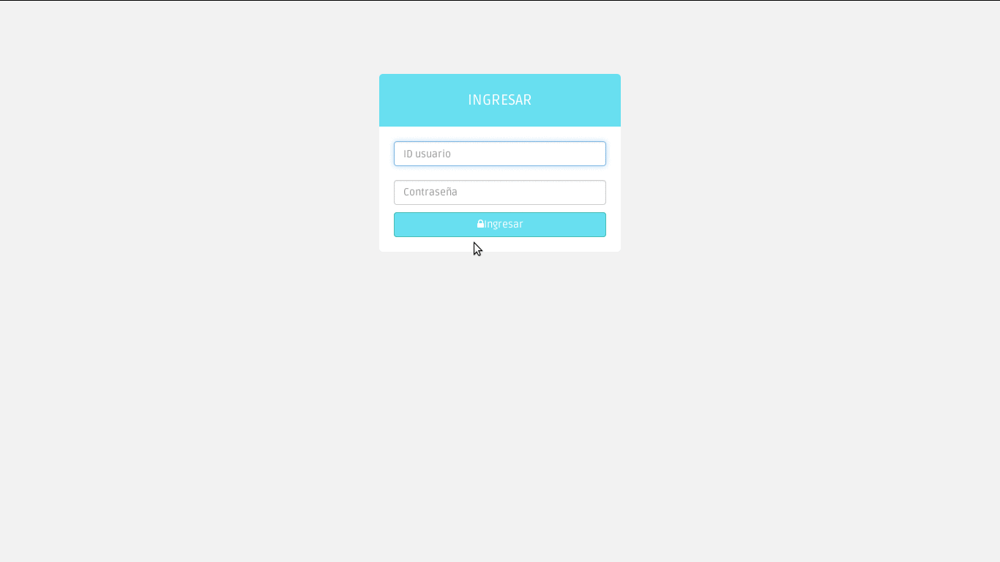

# Qpanel

Qpanel is dashboard for Queues in Asterisk and FreeSWITCH



## Overview

Qpanel is a panel for queues on Asterisk and FreeSWITCH, powerful and simple monitor in realtime:

* General resume for calls. Abandoned, Incoming, Answer time and Waiting time.
* Show information on detail by queue.
* Show agents status if these are free, busy or unavailable.
* Pause reason and time to agents
* Percent of abandoned calls.
* Allows rename the queue name or hide in case if required not show a determined queue.
* Show callers by queue with the priority and wait time.
* Simple configuration. Just use Asterisk manager.
* Written on Python.
* Responsive design.
* Opensource by MIT licence.


Also you can use a [API of Qpanel](doc/api.md) for data query related to queues


## Requirement
 * Python 2.6+
 * [Flask](http://flask.pocoo.org/) 0.10+
 * [Asterisk](http://www.asterisk.org) 1.4+ and enabled manager or [FreeSWITCH](http://www.freeswitch.org) and connection permission to Event Socket Library.


### Asterisk
On /etc/asterisk/manager.conf do you set command permission for read and write, example:

```
    [qpanel]
    secret = mi_super_secret_password
    read = command
    write = command
```
Some features maybe not included in your Asterisk version. In the [patch
directory](patches) you can find the patchs for add more powerfull to the QPanel.


### Freeswitch

The feature realtime counter for answered and abandoned calls in a  queues if not included in your FreeSWITCH version. In the [patch
directory](patches/freeswitch) you can find the patch


You can configure a freeswitch section for your config.ini file like

```
    [freeswitch]
    host = 127.0.0.1
    port = 8021
    password = ClueCon
```

In general section set config

```
    freeswitch = True ; Use FreeSWITCH as backend. Use mod_callcenter
```

 If you used a CentOS 5.X or Elastix check [how to install Python 2.6 and Flask](doc/README.Centos5.md)

## 1. Install flask and dependencies
```
 $ pip install Flask
 $ pip install flask-babel
 $ pip install flask-login
```
If dont have pip in your system. For install

### Debian and Ubuntu
 ```
 sudo apt-get install python-pip
 ```

### Fedora
 ```
 sudo yum install python-pip
 ```


## 2. Clone this repository
```
 git clone -b stable  https://github.com/roramirez/qpanel.git
```
##  3. Go and prepair environment
 ```
  cd qpanel
  git submodule init
  git submodule update
  cp config.ini-dist config.ini
 ```
  Edit config.ini with Manager Asterisk parameters

## 4.- Translations
 ```
  pybabel compile -d translations
 ```


## 5.- Run and relax
 ```
    python app.py
 ```

Go url of machine http://IP:5000

If you want run QPanel like a service, see the [samples configurations
files](samples/configs). Here a example for use USWGI +  NGINX

## New features?
If you like new features or something is wrong [please open a issue](https://github.com/roramirez/qpanel/issues/new)

If you want check the development version get checkout of master branch

 ```
 git clone -b master  https://github.com/roramirez/qpanel.git
 ```
